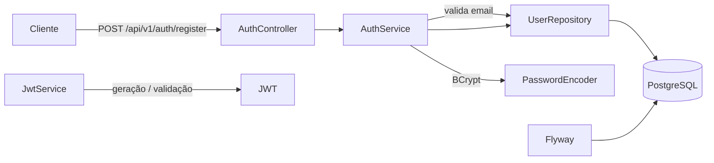
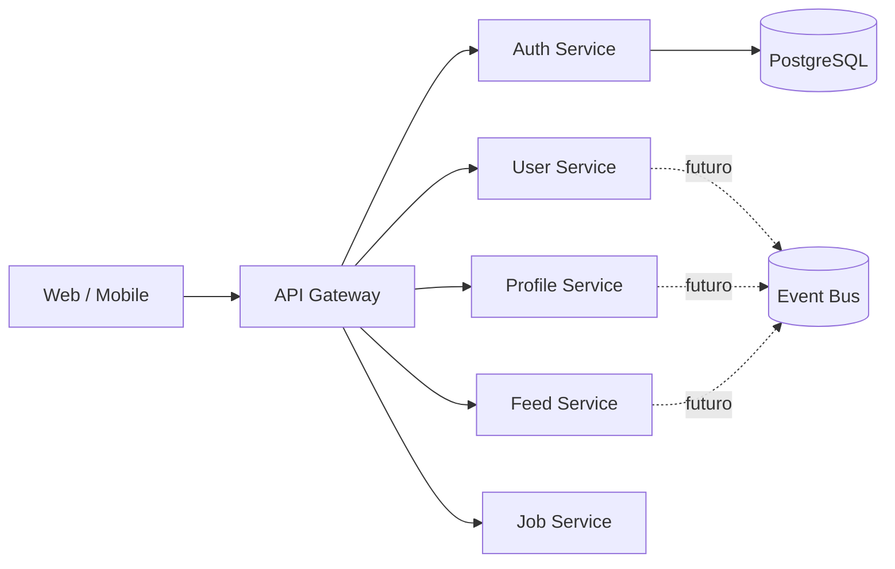
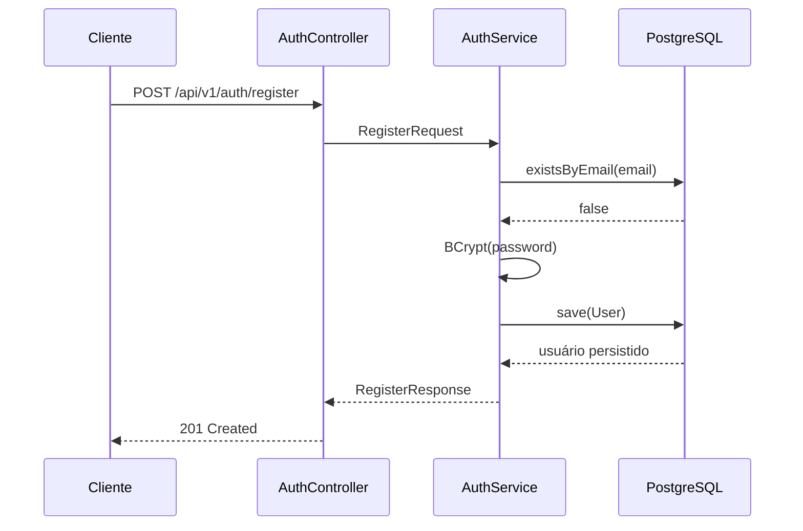

# 🌐 ConnectSphere Enterprise

> Plataforma social corporativa em evolução, com foco atual no **Auth Service** usando **Java 21, Spring Boot, Spring Security, JWT, PostgreSQL, Flyway e Docker**.

[](https://www.oracle.com/java/)
[](https://spring.io/projects/spring-boot)
[](https://www.postgresql.org/)
[](https://www.docker.com/)
[](https://github.com/juceliocoelho2022/ConnectSphere-Enterprise/actions/workflows/ci.yml)
[](LICENSE)

---

## 🎯 Sobre o projeto

O **ConnectSphere Enterprise** é um projeto de portfólio criado para evoluir de um serviço de autenticação sólido para uma plataforma social corporativa baseada em serviços independentes.

O repositório hoje possui **um serviço implementado: `auth-service`**. O foco atual está em cadastro de usuários, segurança de credenciais, persistência com PostgreSQL, migrations com Flyway e construção da infraestrutura JWT.

A documentação separa explicitamente o que **já existe no código** do que está no **roadmap**, evitando apresentar funcionalidades futuras como concluídas.

---

## ✅ O que está implementado

### Auth Service

- [x] Estrutura Spring Boot com Java 21
- [x] API REST versionada em `/api/v1/auth`
- [x] Cadastro de usuários
- [x] Validação de e-mail duplicado
- [x] Validação de entrada com Bean Validation
- [x] Hash de senha com BCrypt
- [x] Persistência com Spring Data JPA
- [x] PostgreSQL 17
- [x] Flyway com migrations versionadas
- [x] Status e atributos de segurança da conta
- [x] Tratamento global de exceções
- [x] Configuração inicial do Spring Security
- [x] Serviço JWT para geração e validação de tokens
- [x] Configuração por variáveis de ambiente
- [x] Docker Compose para PostgreSQL
- [x] Spring Boot Actuator disponível como dependência
- [x] OpenAPI/Swagger disponível como dependência
- [x] Pipeline de CI com Java 21 e PostgreSQL

### Em implementação

- [ ] Login completo
- [ ] Integração do `JwtAuthenticationFilter` ao Security Filter Chain
- [ ] Autenticação stateless com Bearer Token
- [ ] Refresh Token
- [ ] Logout
- [ ] Roles e Permissions / RBAC
- [ ] Testes unitários e de integração do fluxo de autenticação

> O endpoint `/api/v1/auth/login` já existe, mas a lógica de login ainda está marcada no código como não implementada.

---

## 🏗️ Arquitetura atual



### Evolução planejada



---

## 🔐 Fluxo de cadastro



---

## 📡 API atual

### Cadastrar usuário

```http
POST /api/v1/auth/register
Content-Type: application/json
```

Exemplo:

```json
{
  "firstName": "Jucelio",
  "lastName": "Coelho",
  "email": "dev@example.com",
  "password": "StrongPassword123!"
}
```

Resposta esperada: **HTTP 201 Created** com os dados públicos do usuário cadastrado.

### Login

```http
POST /api/v1/auth/login
```

O contrato do endpoint já existe, mas o método de serviço ainda está em desenvolvimento. A infraestrutura de `JwtService` já gera, extrai e valida tokens; a próxima etapa é conectar autenticação, emissão de token e filtro JWT ao fluxo HTTP.

---

## 🧱 Estrutura do repositório

```text
ConnectSphere-Enterprise/
├── .github/
│   └── workflows/
│       └── ci.yml
├── backend/
│   └── auth-service/
│       ├── pom.xml
│       └── src/
│           └── main/
│               ├── java/com/connectsphere/auth/
│               │   ├── config/
│               │   ├── controller/
│               │   ├── domain/
│               │   ├── dto/
│               │   ├── exception/
│               │   ├── mapper/
│               │   ├── security/
│               │   └── service/
│               └── resources/
│                   ├── db/migration/
│                   ├── application.yaml
│                   ├── application-dev.yml
│                   ├── application-test.yml
│                   └── application-prod.yml
├── docker/
│   └── docker-compose.yml
├── .env.example
├── .gitignore
├── LICENSE
├── pom.xml
└── README.md
```

---

## 🛠️ Stack atual

| Tecnologia | Uso |
|---|---|
| Java 21 | Linguagem principal |
| Spring Boot 4.0.7 | Framework da aplicação |
| Spring Web MVC | API REST |
| Spring Security | Segurança HTTP |
| BCrypt | Hash de senha |
| JJWT | Geração e validação de JWT |
| Spring Data JPA | Persistência |
| PostgreSQL 17 | Banco relacional |
| Flyway | Migrations de banco |
| Bean Validation | Validação de DTOs |
| Lombok | Redução de boilerplate |
| OpenAPI / Swagger | Documentação da API |
| Actuator | Saúde e observabilidade básica |
| Docker Compose | Infraestrutura local |
| GitHub Actions | Integração contínua |

---

## 🗄️ Modelo inicial de usuário

A primeira migration cria a tabela `users` com informações de identidade, credenciais e atributos de segurança da conta:

```text
users
├── id
├── uuid
├── first_name
├── last_name
├── email
├── password
├── enabled
├── account_non_locked
├── credentials_non_expired
├── status
├── created_at
└── updated_at
```

---

## 🚀 Como executar

### Pré-requisitos

- Java 21
- Maven 3.9+
- Docker Desktop
- Docker Compose
- Git

### 1. Clone

```bash
git clone https://github.com/juceliocoelho2022/ConnectSphere-Enterprise.git
cd ConnectSphere-Enterprise
```

### 2. Configure as variáveis

Crie seu arquivo local a partir do exemplo:

```bash
cp .env.example .env
```

No PowerShell:

```powershell
Copy-Item .env.example .env
```

Preencha uma senha local para o PostgreSQL e um segredo JWT longo e aleatório.

> O arquivo `.env` é ignorado pelo Git. Não versione credenciais reais.

### 3. Suba o PostgreSQL

```bash
docker compose --env-file .env -f docker/docker-compose.yml up -d
```

O banco local ficará disponível em:

```text
localhost:5434
```

### 4. Exporte as variáveis para a aplicação

Exemplo em PowerShell:

```powershell
$env:DB_URL="jdbc:postgresql://localhost:5434/connectsphere"
$env:DB_USERNAME="postgres"
$env:DB_PASSWORD="SUA_SENHA_LOCAL"
$env:JWT_SECRET="SEU_SEGREDO_LONGO_E_ALEATORIO"
```

### 5. Execute

Na raiz do repositório:

```powershell
.\mvnw.cmd spring-boot:run -pl backend/auth-service
```

Ou execute `AuthServiceApplication` pela IDE.

O serviço usa a porta:

```text
http://localhost:8085
```

---

## ⚙️ CI

O workflow `.github/workflows/ci.yml` sobe PostgreSQL 17 e executa o build com Java 21:

```text
Push / Pull Request
        ↓
GitHub Actions
        ↓
PostgreSQL 17
        ↓
Java 21
        ↓
Maven clean verify
```

---

## 🔒 Segurança de configuração

Credenciais e segredo JWT são lidos por variáveis de ambiente:

```text
DB_URL
DB_USERNAME
DB_PASSWORD
JWT_SECRET
JWT_ACCESS_TOKEN_EXPIRATION
JWT_REFRESH_TOKEN_EXPIRATION
```

O repositório fornece `.env.example` apenas como documentação de configuração.

> Se uma credencial real tiver sido versionada anteriormente, removê-la do arquivo atual não a remove automaticamente do histórico Git. Essa credencial deve ser rotacionada e, quando necessário, o histórico pode ser saneado com ferramentas apropriadas.

---

## 🗺️ Roadmap

### Fase 1 — Auth Service

- [x] Cadastro
- [x] BCrypt
- [x] PostgreSQL
- [x] Flyway
- [x] Base JWT
- [x] CI
- [ ] Login funcional
- [ ] JWT Filter
- [ ] Refresh Token
- [ ] RBAC
- [ ] Testes de integração

### Fase 2 — Identidade

- [ ] User Service
- [ ] Profile Service
- [ ] API Gateway
- [ ] Comunicação entre serviços

### Fase 3 — Plataforma social

- [ ] Feed Service
- [ ] Messaging Service
- [ ] Notification Service
- [ ] Company Service
- [ ] Job Service
- [ ] Search Service

### Fase 4 — Clientes e infraestrutura

- [ ] Frontend React
- [ ] Aplicativo Android Kotlin
- [ ] Mensageria
- [ ] Redis
- [ ] Observabilidade
- [ ] Kubernetes / Cloud

---

## 🎓 Conceitos demonstrados

`Java 21` · `Spring Boot` · `REST API` · `Spring Security` · `JWT` · `BCrypt` · `PostgreSQL` · `JPA` · `Flyway` · `Docker` · `CI/CD` · `Validação` · `Tratamento de Exceções`

---

## 👨‍💻 Autor

**Jucelio Farias Coelho**

Java Backend Developer em desenvolvimento profissional, com foco em APIs REST, Spring Boot, segurança, bancos de dados e sistemas distribuídos.

- GitHub: https://github.com/juceliocoelho2022
- LinkedIn: https://www.linkedin.com/in/jucelio-desenvolvedor-sistema

---

## 📌 Status

🚧 **Em desenvolvimento ativo.** O Auth Service possui cadastro funcional e infraestrutura inicial de segurança/JWT; login completo e autenticação Bearer são as próximas entregas.
